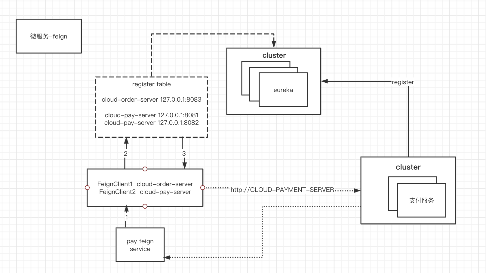

# Spring Cloud学习笔记

## 一. springcloud


### 1. 版本选择

​		https://docs.spring.io/spring-cloud/docs/current/reference/html/

## 二、服务注册与发现

### 1. eureka

#### 1.1. 使用

- 父级引入依赖管理

  ```xml
   <dependencyManagement>
     <dependencies>
       <dependency>
         <groupId>org.springframework.cloud</groupId>
         <artifactId>spring-cloud-dependencies</artifactId>
         <version>Hoxton.SR1</version>
         <type>pom</type>
         <scope>import</scope>
       </dependency>
     </dependencies>
   </dependencyManagement>
  ```

- 服务端

  - 引入服务相关依赖

  ```xml
  <dependency>
    <groupId>org.springframework.cloud</groupId>
    <artifactId>spring-cloud-starter-netflix-eureka-server</artifactId>
  </dependency>
  ```

  - 添加允许服务端启动注解

    ```
    @EnableEurekaServer
    ```

- 客户端

  - 引入客户端相关依赖

    ```xml
    <dependency>
        <groupId>org.springframework.cloud</groupId>
        <artifactId>spring-cloud-starter-netflix-eureka-client</artifactId>
    </dependency>
    ```

  - 添加允许客户端启动注解

    ```
    @EnableEurekaClient
    ```

#### 1.2. 集群版本


##### 1.2.1. eureka集群

	- Eureka1:

```properties
server.port=7001

eureka.instance.hostname=eureka7001.com
# 表示不向注册中心注册自己
eureka.client.register-with-eureka=false
# 表示自己端就是注册中心，我的职责就是维护服务器实例，并不需要检索服务
eureka.client.fetch-registry=false
eureka.client.service-url.defaultZone=http://eureka7002.com:7002/eureka/
```

- Eureka2:

```properties
server.port=7002

eureka.instance.hostname=eureka7002.com
# 表示不向注册中心注册自己
eureka.client.register-with-eureka=false
# 表示自己端就是注册中心，我的职责就是维护服务器实例，并不需要检索服务
eureka.client.fetch-registry=false
# 在7001注册7002服务
eureka.client.service-url.defaultZone=http://eureka7001.com:7001/eureka/
```

##### 1.2.2. 支付服务集群

- payment-server1

```properties
server.port=8081
spring.datasource.url=jdbc:mysql://127.0.0.1:3306/sc_payment?characterEncoding=utf8&useSSL=false&serverTimezone=GMT%2B8
spring.datasource.username=root
spring.datasource.password=rootroot
spring.datasource.driver-class-name=com.mysql.jdbc.Driver
mybatis.mapperLocations=classpath:mapper/*.xml
mybatis.typeAliasesPackage=com.wuyuefeng.model

spring.application.name=cloud-payment-server

eureka.client.register-with-eureka=true
eureka.client.fetch-registry=true
eureka.client.service-url.defaultZone=http://eureka7001.com:7001/eureka, http://eureka7002.com:7002/eureka
```

- payment-server2

```properties
server.port=8082
spring.datasource.url=jdbc:mysql://127.0.0.1:3306/sc_payment?characterEncoding=utf8&useSSL=false&serverTimezone=GMT%2B8
spring.datasource.username=root
spring.datasource.password=rootroot
spring.datasource.driver-class-name=com.mysql.jdbc.Driver
mybatis.mapperLocations=classpath:mapper/*.xml
mybatis.typeAliasesPackage=com.wuyuefeng.model

spring.application.name=cloud-payment-server

eureka.client.register-with-eureka=true
eureka.client.fetch-registry=true
eureka.client.service-url.defaultZone=http://eureka7001.com:7001/eureka, http://eureka7002.com:7002/eureka
```

##### 1.2.3. 订单中心修改

- 指定支付服务的路径

  **地址使用eureka注册中心的地址，而不是服务本身的地址：http://CLOUD-PAYMENT-SERVER**

- 使用template调用负载均衡

  **在template bean中添加注解@Loadblanced**

#### 1.3. 服务发现

- @DiscoveryEnable
- 引入discoveryClient bean，然后根据对应的bean获取当前eureka服务的信息
  - 实例的数量
  - 实例的端口号及对应的ip

#### 1.4. CAP原则

   	CAP原则又称CAP定理，指的是在一个分布式	系统中，一致性（Consistency）、可用性可用性（Availability）、分区容错性（Partition tolerance）。CAP 原则指的是，这三个要最多只能同时实现两点，不可能三者兼顾。

- eureka使用的AP原则

##### 1.4.1. 自我保护原则

##### 1.4.2. 关闭服务端自我保护机制

```properties
# 关闭自我保护机制
eureka.server.enable-self-preservation=false
eureka.server.evication-interval-in-ms=2000
```

##### 1.4.3. 设置client端心跳包发送

```properties
# 想服务端发送心跳的时间间隔
eureka.instance.lease-renewal-interval-in-seconds=1
# 服务端在收到最后一次心跳后等待时间上线，超时会注销服务
eureka.instance.lease-expireation-duration-in-seconds=2
```

### 2. zookeeper

- 添加相关依赖

```xml
<dependency>
	<groupId>org.springframework.cloud</groupId>
	<artifactId>spring-cloud-starter-zookeeper-discovery</artifactId>
</dependency>
```

- 解决依赖版本和zk版本冲突问题

  ```xml
  <dependency>
  	<groupId>org.springframework.cloud</groupId>
  	<artifactId>spring-cloud-starter-zookeeper-discovery</artifactId>
    <exclusions>
    <!-- 排除自带的zookeeper版本 -->  
      <exclusion>
        <groupId>org.apache.zookeeper</groupId>
        <artifactId>zookeeper</artifactId>
      </exclusion>
    </exclusions>
    <!-- 引入新的版本 -->
    <dependecy>
      <groupId>org.apache.zookeeper</groupId>
      <artifactId>zookeeper</artifactId>
      <version>${zk.version}</version>
    </dependecy>
  </dependency>
  ```


### 3. consul

### 4. Nacos（推荐）

## 三、服务负载与调用

### 1. Ribbon

​	基于netflix ribbon实现的一套客户端**负载均衡**的工具，主要功能是提供客户端的软件**负载均衡算法和服务调用**；ribbon客户端组件提供一些完善的配置项，如链接超时，重试等。简单的说，就是在配置文件中列出load Balancer（LB）后面的所有机器，ribbon会自动的帮助你基于某种规则（如简单轮询、随机链接等）去链接这些机器。

#### 1.1. 负载均衡分类

 - 进程内LB: 本地负载均衡客户端（例如：ribbon）,在调用微服务接口的时候，会在注册中心上获取注册信息服务列表之后缓存到jvm本地，从而在本地实现rpc远程服务调用技术。

 - 集中式LB: 服务端负载均衡（例如：nginx）：

   请求 -> nginx -> ribbon->server1/server2/..

#### 1.2. 二说restTemplate

​	todo: - 源码解读

- getForEntity

#### 1.3. eureka集成ribbon

#### 1.4. LB的均衡算法

- ribbon默认使用轮训的方式实现负载均衡

- IRule接口，根据当前接口选择自己的负载均衡算法，扩展负载均衡器

  - 在springboot中注册IRule对应的组件
  - 实现对应的负载均衡代码

- todo: - Ribbon自带的规则源码解读

- 实现继承使用

- eureka自带的负载均衡算法

  - ```
    RoundRobinRule
    ```

- Todo-: 手写负载均衡算法

  - 继承loadBalance接口，实现方法
  - 注册为对应的bean，且当前bean必须返回对应的负载均衡的service
  - 通过@autowire注入bean，代码获取对应的service
  - 并通过restTemplate进行远程调用，测试LB算法是否使用

#### 1.5. 替换LB默认的负载均衡算法

- 新建一个工具包，不能包含在app包下及app所在当前包，否则

  ```
  ```

  

- 自定义类，书写自己的规则

  - 在springboot中注入自己的bean
  - 直接返回一个规则的实例，并且打印日志

- 启动类添加@RibbonClient(name = "service name", configuration=自定义规则.class)

### 2. Loadbalancer

### 3. Feign

### 4. OpenFeign（推荐）

​	feign是一个声明式webservice客户端。使用feign能让web service客户端更简单；他的使用方法是**定一个服务接口**，然后在上面添加注解(@FeignClient)。spring cloud对Feign进行了封装，使其支持spring mvc标准注解和httpMessageConverters. Feign可以与Eureka和Ribbon组合使用以支持负载均衡。

​	ribbon和feign之间的区别：

​		ribbon本身是一个负载均衡，通过调用restTemplate进行封装后，进行负载均衡的调用，而feign则是在此基础上进行了一层封装，解决一个接口被多处调用的问题，通常会针对每个微服务自行封装一些客户端类来包装这些依赖服务的调用。通过对接口增加一个feign的注解就可以完成服务端的接口绑定（类似@mapper注解标注的Dao接口）



#### 4.1. 使用

- 引入依赖

  ```xml
  <dependency>
      <groupId>org.springframework.cloud</groupId>
      <artifactId>spring-cloud-starter-openfeign</artifactId>
  </dependency>
  ```

- Main方法添加注解、接口添加注解及对应的方法

  ```java
  @EnableFeignClients
  ```

  ```java
  @Component
  @FeignClient("CLOUD-PAYMENT-SERVER")
  public interface PaymentFeignService {
  
      @GetMapping("/pay/account/{id}")
      JSONObject getAccountInfo(@PathVariable("id") Integer id);
  }
  ```

- 添加controller并测试

  ```java
  @RestController
  @Slf4j
  public class PaymentFeignController {
  
      @Resource
      PaymentFeignService service;
  
      @GetMapping("/consumer/account/{id}")
      public JSONObject getAccountInfo(@PathVariable Integer id){
          return service.getAccountInfo(id);
      }
  }
  ```

#### 4.2. 超时控制

​	类似restTemplate通过注解声明组件的bean，并对bean进行配置

#### 4.3. 日志增强

​	包含了请求的接口，请求接口的方法，状态码，等相关的debug调试信息，

#### 4.4. 思考: 为什么不直接用方法调用而用feign

## 四、服务熔断/降级/限流

### 1. Hystrix

​		服务雪崩，hystrix解决服务降级，延迟和容错机制，处理超时和异常的场景，能够保证在一个依赖出问题的情况下，不会导致整体服务的失败，避免级联故障，以提高分布式系统的弹性。

​		当某个服务单元发生故障之后，通过断路器的故障监控，向调用方返回一个符合可预期，可处理的备选响应（fallback），而不是长时间的等待。

#### 1.1. 服务降级-fallBack

##### 1.1.1. 发生情况

-  程序异常
- 超时: 直接返回处理方法的结果
- 服务熔断出发服务降级
- 线程池/信号量打满也会导致服务降级

##### 1.1.2. 实现

- 服务端添加注解标签

```java
@EnableCircuitBreaker
```

- 创建服务降级的处理方法

```java
// 若请求超时，直接返回提示内容，以此达到服务降级的效果
public String timeSleepHandler() {
    return "服务器繁忙，请稍后再试";
}
```

- 指定方法若要服务降级，指向服务降级的方法

```java
@HystrixCommand(fallbackMethod = "timeSleepHandler", commandProperties = {
        @HystrixProperty(name = "execution.isolation.thread.timeoutInMilliseconds", value = "3000")
})
public String timeSleep() throws InterruptedException {
    TimeUnit.SECONDS.sleep(5);
    return "线程池: " + Thread.currentThread().getName();
}
```

##### 1.1.3. 实现全局默认的服务降级

- 添加默认服务降级的方法的注解

```
@DefaultProperties(defaultFallback = "globalFallBackHandler")
```

- 创建全局服务降级方法

```java
 // 有自定义的走自定义，无自定义直接走全局
    public String globalFallBackHandler() {
        return "服务器繁忙，请稍后再试，全局服务降级";
    }
```

- 对异常、超时的方法添加指定注解

```
@HystrixCommand
```

##### 1.1.4. feign服务使用服务降级

​	同1.1.2的内容，只是要打开feign对应的服务降级的控制

- properties文件打开feign hystrix服务降级

```properties
feign.hystrix.enabled=true
```

- 启动类的@EnableCircuitBreaker修改成@EnableHystrix

- 针对各个方法的自定义服务降级

  - 实现该服务的接口，并且实现其方法，对方法进行实现，保证若有超时、异常等，此时方法生效，并注册成组件
  - 在接口添加@FeignClient(value = "CLOUD-PAYMENT-SERVER", fallback = PaymentFeignFallBackService.class)，fallback指向处理的接口

  - 此时若有服务宕机、接口超时、接口异常等信息，都会统统用该方法返回结果

#### 1.2. 服务熔断-fallDown

​		达到最大服务访问后，直接拒绝访问，然后调用服务降级的方法，并返回友好提示，降级->熔断->恢复调用


#### 1.3. 服务限流-fallLimit

​		秒杀高并发等操作，控制单位时间内的qps

#### 1.4. 项目构建

	- 引入相关依赖
	- 编写超时接口，线程睡眠三秒
	- 并发工具JMETER测试对应的接口，200线程，100个并发，1秒，进行超时请求接口测试
	- 正常的接口因为负载会响应变慢，超时的接口依然还是很慢

#### 1.5. 改进措施

- 添加consumer的feign模块
- 调用上面建立好的服务（hystrix payment）
- 高并发测试 consumer feign的服务，会发现需要等待，或者是直接返回超时（犯规的数据不优雅，界面直接 white page error），此时并发量太大，甚至可能导致宕机
- Hystrix解决的问题
  - 超时不再等待
    - 对方服务器（pay server）超时或宕机了，调用（consumer）不能一直卡死等待，必须有服务降级
    - 对方服务ok，调用者consumer自己出故障或者有自我要求（自己的等待时间小于服务提供者），自己处理降级

#### 1.6. 解决方案

##### 1.6.1. 服务降级

##### 1.6.2. 服务熔断

##### 1.6.3. 服务限流

### 2. Resillience4j

### 3. springCloud Alibaba sentienl（推荐）

## 五、服务网关

### 1. Zuul

### 2. Gateway(推荐)

## 六、服务分布式配置-spring cloud config

### 1. Config

### 2. Nacos（推荐）

## 七、服务开发-spring boot

### 1. Bus

### 2. Nacos（推荐）

## 其他知识补充


### 1. dependencyManagement与dependencies区别

​	dependencyManagement一般在maven最外层的pom使用，用于声明依赖对应的版本号，本身没有实际作用，在子模块中引用相同依赖的时候不需要指定依赖的版本号，子模块引用的依赖会根据继承关系直接找到dependencymanagement里面的版本号，然后直接引用，而dependcies里面声明的依赖可以直接被子模块引用，不需要重复声明的

### 2. Maven 标签

- `<type>`
  - 默认不指定的时候是jar
- `<scope>`
  - compile : 指定依赖需要参与到，编译、打包、运行等阶段
  - Provided: 只参与编译、测试、运行，但是在打包的时候会做一个exclude的动作，因为可能应用所挂在的容器服务已经提供了exclude所需要的包
  - runtime：无需参与编译，但是会参与到项目的测试和运行阶段，与compile相比，被依赖项目无需参与编译
  - test: 仅仅在测试的时候使用
  - system: 与provided类似，但是依赖不会从maven仓库中找，而是从本地仓库获取，有systemPath来指定jar所在的路径
  - Import: 只会在dependecyManagement中使用，标识从其他的pom中导入dependency的配置，例如B项目导入A项目中的包配置


